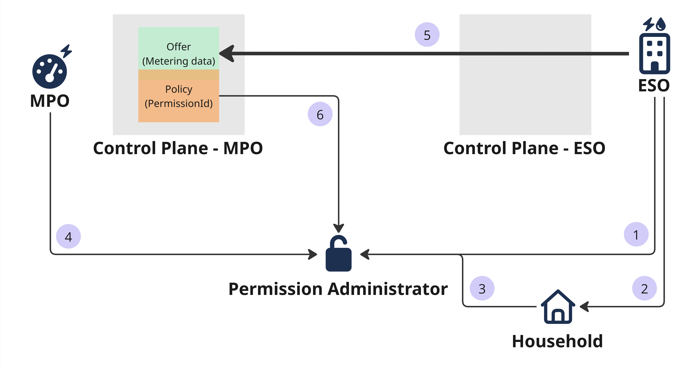

# Integration Permission Administrator (Experimental)

```
This feature is currently marked as ‘Experimental’. There is no guarantee that the feature will behave as expected, as there are many external dependencies that may change. Furthermore, this feature is under active development; this documentation may be out of sync with the actual implementation.
```



Under the Commission Implementing Regulation (EU) `2023/1162`, there is a need for a `Permission Administrator` through which an end customer can manage its permissions for its metering data with third parties. 
In Germany, `50Hertz` (one of the four TSOs) has implemented the `Permission Administrator` under the name `For.Watt`. 
Therefore, the following description assumes the usage of the `For.Watt` implementation.

The picture above visualizes the abstracted process for the `Permission Administrator`.
Initially, an `Energy Service Offerer (ESO)` starts a permission request with the `Permission Administrator` to obtain the `Household's` permission to use its metering data **(1)**. 
The `ESO` receives a permission link to forward to the `Household`, which can either permit or reject the request **(2)**. 
The `Household` then makes its decision **(3)**. 
It is important to say that the `Household` can withdraw its permission at any time. 
Before data can be requested, the `Metering Point Operator (MPO)` must also check the permission request and its correctness **(4)**.
Now, the `ESO` can begin negotiations on the `Offer` through its Connector **(5)**. 
During contract negotiation, the `Policy Engine` checks, via a defined `Policy` that contains the `ID` of the associated permission request, whether all parties (the `ESO` and `Household`) permit the data transfer **(6)**. 
If all permissions are in place, the data can be fetched. 
If one of the relying parties withdraws its permission, the `Policy Engine` will stop the active data transfer.

## Requirements from For.Watt

We need the following Accounts and API access:
- An onboarded `MPO` in the `EPIC` portal
- An onboarded `Household` in `For.Watt`
- An API account as `ESO` in `For.Watt` to start a permission request

## Create the Permission Administrator Policy

The `Policy` will hold the permission request `ÌD`, which is returned after we start a permission request as an `ESO` through the API.
The `ESO` needs to share that `ID` with the `MPO`, as the `MPO` must create the policy for its metering `Asset`.

Therefore, create a `Policy` defined as follows as the `MPO`:

```json
{
  "@context": [
    "https://w3id.org/edc/connector/management/v0.0.1"
  ],
  "@id": "permission-administrator-required",
  "@type": "PolicyDefinition",
  "policy": {
    "@type": "Set",
    "permission": [
      {
        "action": "use",
        "constraint": {
          "leftOperand": "permission_request_id",
          "operator": "eq",
          "rightOperand": "3b6040cb-0fd9-4636-9bd2-f87ec8c8bf21"
        }
      }
    ],
    "prohibition": [],
    "obligation": []
  }
}
```

Create an `Offer` as shown in the `Decentralized Catalog` showcase (see [02-02-01](../02-01-catalog/README.md)) afterward, and follow the introduction for negotiation and the data transfer process.

If the `Household` or the `MPO` withdraws its permission, the `Policy Engine` may take up to 30 seconds to recognize the change and terminate all active transfer processes for the `Offer`.

Using the environment variable `EDC_POLICY_MONITOR_STATE-MACHINE_ITERATION-WAIT-MILLIS` in the `Control Plane`, we can adjust the time between reevaluations of all `Policies` by the `Policy Engine`.