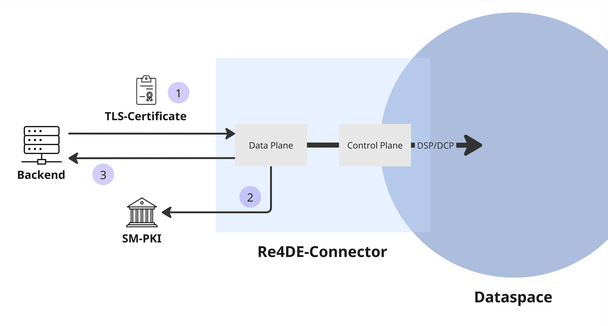

# Integration Smart-Meter PKI with dataspace concepts



In general, the authentication layer in our dataspace is provided through `OAuth2/X.509` or the `DCP`.
While this authentication is used only for communication between `Control Planes`, the actual data transfer from a `Data Plane` is secured by the `JWT` provided via the `EDR` endpoint (see [02-01-catalog](../02-01-catalog/README.md)). 

On the other hand, in the German energy sector, participants must authenticate themselves with certificates issued by the `Smart-Meter PKI (SM-PKI)`.
During data exchange, depending on the protocols and interfaces used, multiple certificates are required for `mTLS`, `encryption`, and `signing`. 

To combine both worlds, we extended the `Data Plane`.
As shown in the picture above, if a backend or any other service requests the `Data Plane` and the `Asset` to pull is marked for an `SM-PKI` check, the backend must provide a valid certificate from `the SM-PKI` **(1)**. 
The `Data Plane` will then check and validate the received certificate with the `SM-PKI` **(2)**.
If all checks pass, the data will then be transferred **(3)**. 

```
Currently, Re4DE only supports certificates from the 'Smart-Meter Beta-PKI'!
```

## Asset configuration (Data Provider)

Let's take our asset from our catalog showcase, which was defined as follows:

```json
{
    "@context": [
        "https://w3id.org/edc/connector/management/v0.0.1"
    ],
    "@id": "my-asset",
    "@type": "Asset",
    "properties": {
        "name": "My Asset",
        "description": "This is a test asset that provides random cat images.",
        "contenttype": "application/json"
    },
    "dataAddress": {
        "@type": "DataAddress",
        "type": "HttpData",
        "baseUrl": "https://api.thecatapi.com/v1/images/search",
    }
}
```

To activate the need for a certificate, we need to adjust the configuration of the `dataAddress` as follows:

```json
...
  "dataAddress": {
    "@type": "DataAddress",
    "type": "HttpData",
    "baseUrl": "https://api.thecatapi.com/v1/images/search",
    "pki:validate": "true",
    "pki:headerName": "x-pki-cert"
  }
...
```

As a `Data Provider`, we are done.

## Sending the certificate (Data Consumer)

As the `Data Consumer`, we now need to send our certificate using the header defined in the last step. 
Assuming we have a valid certificate saved in the file `sm-cert.pem` and a valid `JWT` from the `EDR`, the request would look like this:

```bash
$ curl -X GET http://localhost:18185/api/public                              \
    -H "Content-Type: application/json"                                      \
    -H "Authorization: eyJraWQiOiJ2ZXJpZmllci1rZXkiLC...KP3tMbXWx7Q98wg"     \
    -H "x-pki-cert: -----BEGIN CERTIFICATE-----...-----END CERTIFICATE-----" 
```

You should receive a response with a link that follows to a random cat image.